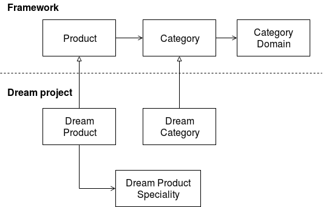

# Entity Extension

This article describes the internals of entity extension system implemented in Shopsys Framework along with a quick guide on how to use it.
The entity extension is a work in progress.

You can read about alternative solutions we considered and the reasons behind this approach in [Entity Extension vs. Entity Generation](entity-extension-vs-entity-generation.md).

Let's suppose that we are implementing Dream project as a clone of the [project-base repository](https://github.com/shopsys/project-base).
Dream project is dependent on the glass-box [framework repository](https://github.com/shopsys/framework).
The framework is, of course, independent of our Dream project.

Entities in the framework are full-featured themselves and we want to extend them with our custom properties and associations.
We achieve this via inheritance:

Dream project in the example above has extended entities Category and Product.
An association with a custom entity Dream Product Speciality was added to Product.
CategoryDomain was not extended, this means that the extended Dream Category has an association with the original CategoryDomain.

Doctrine allows us to have only the original entity or the extended entity in the whole system, both are not possible.
So all associations, new objects, repositories, query builders - everything has to be consistent, otherwise, Doctrine will fail.

## How does it work?

The solution is based on Doctrine event subscribers and metadata manipulation.

It is important that the **EntityExtensionParentMetadataCleanerEventSubscriber** runs first and the **LoadORMMetadataSubscriber** runs last.
Otherwise, a conflict with other subscribers modifying the metadata would occur.

Correct order of relevant Doctrine event subscribers:
* EntityExtensionParentMetadataCleanerEventSubscriber
* Gedmo subscribers (*from [gedmo/doctrine-extensions](https://github.com/gedmo/doctrine-extensions)*)
* TranslatableListener (*from [prezent/doctrine-translatable](https://github.com/prezent/doctrine-translatable)*)
* LoadORMMetadataSubscriber (*from [joschi127/doctrine-entity-override-bundle](https://github.com/joschi127/doctrine-entity-override-bundle)*)

### EntityExtensionParentMetadataCleanerEventSubscriber

LoadORMMetadataSubscriber (which must be executed as last) turns the parent entities into MappedSuperclass.
It is better for the parent entities to be turned into MappedSuperclass before any other metadata manipulation is done.
Along with this, it strips all metadata from the parent entities.
This is basically to avoid other event subscribers to consider the parent entities to be real hydratable entities.
The only real problem we encountered was Gedmo's TreeListener, that is used for nested trees of Category entities.

This event subscriber also clears metadata about inheritance from parent entities because,
in Doctrine, a MappedSuperclass entity cannot be also a root entity of true mapped inheritance.
The only real instance of true mapped inheritance in the framework is the OrderItem.

### LoadORMMetadataSubscriber

This is the subscriber that extends entities.
It turns the parent entities into MappedSuperclass and adds parents' metadata into the extended entities.
Also, it replaces all associations with parent entities by the extended entities.
It must have low priority so it runs after Gedmo and Prezent extensions.
Gedmo and Prezent add their own mapping, entity extension must be performed after all metadata are known.

## OrderItem and true mapped inheritance

If we want to extend OrderItem entity itself, we have to extend OrderItem and also all descendants and we end up with inheritance tree shown above.
In Dream project, the descendants (DreamOrderPayment etc.) must extend DreamOrderItem (a direct descendant of OrderItem),
so they have to contain duplicated code from the original descendant entities.
DiscriminatorMap must always contain descendants' FQN because LoadORMMetadataSubscriber reads raw original annotations.

## How can I extend an entity?

As we mentioned in the introduction, there must be only one entity type in the whole system.
So if we just test now, we will probably meet a couple of errors because repositories, query builders, and new objects use the original entities from the framework.
This issue will be addressed in the future, entity extension is a work in progress.

* Create a new entity in your `src/Shopsys/ShopBundle/Model` directory that extends already existing framework entity
  * keep entity and table annotations
  * you can add new properties and use annotations to configure ORM
* Add information about the entity extension into the container configuration
  * add it to the configuration parameter `shopsys.entity_extension.map`
  * use the parent entity name as a key and the extended entity name as a value
  * eg. `Shopsys\FrameworkBunde\Model\Product\Product: DreamProject\Model\Product\Product`
* Now your extended entity should be used instead of the parent entity
